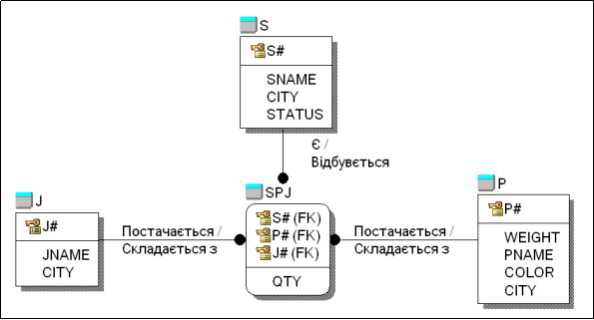
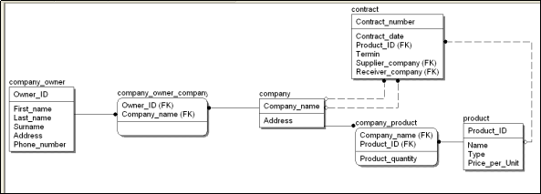

# Практична робота 6
---
Короткий опис
---
У ході роботи було побудовано запит реляційної алгебри для отримання повної інформації про всі договори, в яких беруть участь дві задані фірми. Запит реалізовано за допомогою операції селекції з використанням логічних умов, що враховують ролі постачальника та отримувача. Робота продемонструвала можливість застосування реляційної алгебри для вирішення задач управління даними, зокрема, аналізу договорів між конкретними учасниками.
---
**Завдання 1**
---
Це структура даних для обліку товарів, проєктів і постачальників.
 S - інформація про постачальників.
 P - товари.
 J - проєкти.
 SPJ- поставка.

**Запити реляційной алгебри:**
1.Отримати повну інформацію про постачальників 
> S
2.Отримати повну інформацію про всі товари в Одесі 
> P WHERE CITY='Одеса'
3.Отримати всі поєднання "номер товару-місто товару" 
> P [P#, CITY]
4.Отримати всі імена постачальників 
> S [SNAME]
5.Отримати імена товарів з Харкова білого та синього кольору 
> (P WHERE CITY='Харків' AND (COLOR='Білий' OR COLOR='Синій')) [PNAME]
6.Отримати номери та імена постачальників з Києва зі статусом більше 20 та менше 30 
> (S WHERE CITY='Київ' AND STATUS > 20 AND STATUS < 30) [S#, SNAME]
7.Отримати імена товарів та їх колір, які постачаються постачальником S2. 
> ((SPJ WHERE S#='S2') JOIN P) [PNAME, COLOR]
8.Отримати імена постачальників, які постачають принаймні один товар диван.
> (((P WHERE PNAME='Диван') JOIN SPJ) [S#] JOIN S) [SNAME]
9.Отримати номери проектів, в які постачаються товари з Харкова або постачальником з Києва
> (SPJ JOIN (P WHERE CITY='Харків')) [J#] UNION (SPJ JOIN (S WHERE CITY='Київ')) [J#]
---
**Завдання 2**
---

**Визначені такі сутності:**
1.Company_owner - Зберігає інформацію про власників компаній.
2.Company - Зберігає інформацію про компанії.
3.Contract - Зберігає інформацію про контракти між компаніями.
4.Product - Зберігає інформацію про продукти.

**Запит до предметної області:**
> contract WHERE (Supplier_company = 'Фірма1' AND Receiver_company = 'Фірма2') OR (Supplier_company = 'Фірма2' AND Receiver_company = 'Фірма1')